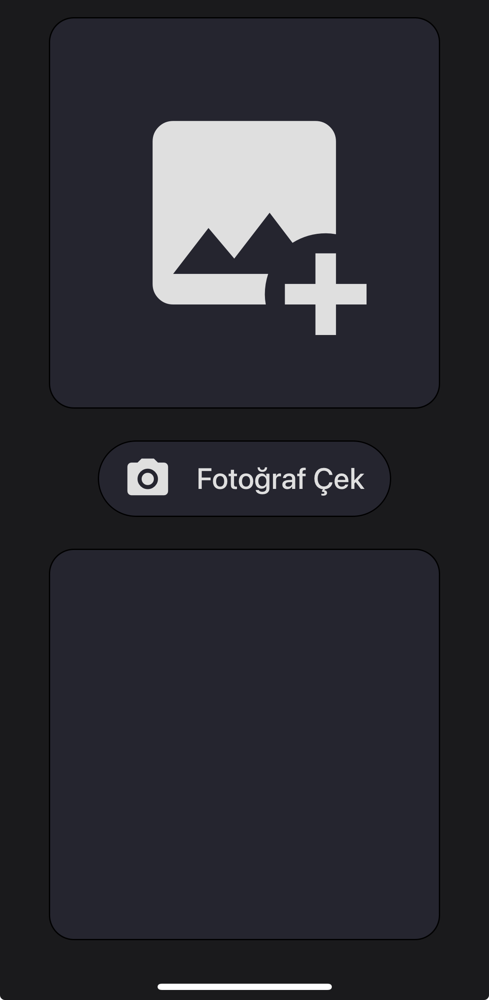
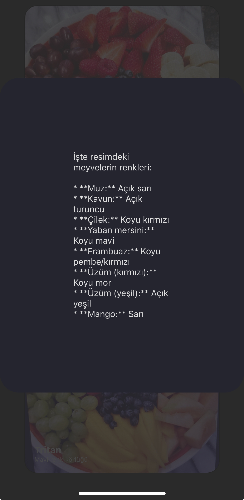

<h1 align="center">TrueColors<h1>

TrueColors is a mobile application designed to help color-blind individuals by processing images in a way that allows them to see colors as they would be perceived by individuals with normal color vision. The app also allows individuals with normal vision to simulate how their photos would look to people with different types of color blindness (Protanopia, Deuteranopia, Tritanopia).

## Features

- **Color Blind Simulation**: Users can take a photo and see how it would appear to people with Protanopia, Deuteranopia, or Tritanopia.
- **Color Enhancement for Color Blind Users**: Allows color-blind individuals to see the colors of their photos more accurately by processing them for Protan, Deutan, and Tritan types.
- **AI Object Detection**: Uses a trained AI model to detect objects in the image and provides output with their colors.
- **User-friendly Interface**: The app has a simple, intuitive interface for easy navigation and photo processing.

## Screenshots

Here’s a preview of the app:

1. **Home Screen**:
   

1. **Process Screen**:
   

1. **Protan Output**:
   

1. **Deutan Output**:
   

1. **Tritan Output**:
   

1. **Caption Output**:
   

## Installation

### Prerequisites

Make sure you have the following installed:

- Node.js
- React Native CLI
- Android Studio or Xcode (for Android/iOS emulation)
- Python (for the backend API)

### Clone the Repository

Clone the repository to your local machine:

```bash
git clone https://github.com/qrivnel/truecolors-react-native.git